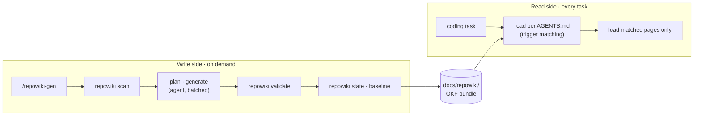

<div align="center">


# repowiki

**Agent-readable project knowledge, generated from your codebase.**

[](LICENSE)
[](https://nodejs.org)
[](#)
[](https://github.com/JAYY513/repowiki/stargazers)

**English** · [简体中文](README.zh-CN.md)

</div>


---

## Why repowiki?

Coding agents re-discover your project from scratch in every session. Answering even a simple "how does X work?" means reading dozens of files — slow, expensive, and inconsistent.

**repowiki turns a codebase into a small wiki written for agents:**

- Pages declare `triggers` — an agent loads only what a task needs (*route-before-body*), never the whole wiki.
- A git baseline records the exact commit the wiki describes — `repowiki status` tells you the moment it goes stale.
- Machines generate; humans stay in control — hand-edited and `protected` pages survive regeneration untouched.

## Features

| Capability | Details |
|---|---|
| **OKF bundle output** | Two families: `knowledge/` module cards (five dimensions, keyed by `dimension`) and `content/` articles; all pages carry `status` / `type` / `triggers` / `description` frontmatter |
| **Zero-dependency CLI** | One Node.js file, no install tree — just Node ≥ 18 |
| **Freshness baseline** | `state.json` pins the wiki to a commit; CI-friendly exit codes (`0` fresh · `10` stale · `11` missing) |
| **Idempotent wiring** | `repowiki init` injects a managed block into `AGENTS.md` — re-runs are no-ops; hand-written `## repowiki` sections keep every line and only get the missing declaration appended |
| **Safe scanning** | Skips secrets (`.env`, keys), files over 1 MB, and ignored paths; honors `.gitignore` and `.repowikiignore` |
| **Human protection** | Content hashes detect manual edits; `protected: true` locks a page; interrupted runs resume via `run.json` |

## How it works



The write side runs only when you ask for it (`/repowiki-gen`). The read side runs on every task: the reader matches task intent against page `triggers` and loads the minimum needed context.

## Quick start

**Requirements** — Node.js ≥ 18, git, and an agent that supports the `.agents` standard.

**1 · Install the skill**

```bash
npx skills add JAYY513/repowiki
```

<details>
<summary>Manual fallback</summary>

Copy `skills/repowiki-gen/` into your skills directory, e.g. `~/.agents/skills/` or `<project>/.agents/skills/`.

</details>

**2 · Tell your agent: *"generate the repo wiki"*** (or run `/repowiki-gen`)

That's all. The skill starts by running `repowiki init` itself (idempotent) to wire your project (managed `AGENTS.md` block + freshness baseline), then scans the codebase, and finally plans, writes, validates and baselines the whole wiki under `docs/repowiki/` — no CLI required on your side.

**3 · Stay fresh**

The wiring makes your agent check freshness as it works. When new commits leave the wiki behind, it will say so — just ask for `/repowiki-gen` again. Regeneration is incremental: only affected pages are rewritten; hand-edited and `protected` pages survive untouched.

## What `init` writes into `AGENTS.md`

The exact content, so you can review it before running. The block lives between HTML comment markers — re-runs update it in place, and your own text stays outside the markers:

```markdown
<!-- repowiki:begin | 由 repowiki 管理：运行 `repowiki init` 原位更新本区块；手写内容请放在标记之外 -->

## repowiki

- docs/repowiki/ — 自动生成的项目知识（未人工验证）

## Wiki 纪律

- 涉及本项目代码理解、修改、排障前，先按 `repowiki` 读取相应内容（按页面 triggers 命中加载，禁止全文扫描）。
- 提交前 / 任务收尾前，运行 `repowiki status` 自查是否过期（退出码 10 = 过期 → 提示用户运行 /repowiki-gen）。
<!-- repowiki:end -->
```

If `AGENTS.md` already has a hand-written `## repowiki` section, the block above is **not** injected. Only the declaration line below is appended after the section's last entry — every existing line is kept as-is:

```markdown
- docs/repowiki/ — 自动生成的项目知识（未人工验证）
```

## Using the CLI directly (optional)

The skill already calls the CLI for you. To run it yourself — CI hooks, debugging, offline:

**Option A · No install, always latest** (needs git):

```bash
npx github:JAYY513/repowiki status    # or: init · scan · state · validate
```

**Option B · Clone once, run from the clone**:

```bash
git clone https://github.com/JAYY513/repowiki.git
node repowiki/bin/repowiki.mjs status
```

Heavy usage? `cd repowiki && npm link` gives a global `repowiki` alias. Already installed the skill? It also ships a bundled copy at `<skills-dir>/repowiki-gen/scripts/repowiki.mjs` — handy offline: `node <skills-dir>/repowiki-gen/scripts/repowiki.mjs status`.

Exit codes — `0` fresh · `10` stale · `11` missing — designed for hooks and CI (`repowiki status --quiet` prints just the word).

## CLI reference

| Command | Description |
|---|---|
| `repowiki init` | Wire a project: `state.json` baseline + idempotent `AGENTS.md` managed block (`## repowiki` sources + reading discipline) |
| `repowiki scan` | Walk the repo (secrets, large files and ignored paths excluded) → `.repowiki/snapshot.json` with paths, SHA-256, size and language |
| `repowiki state` | Print `.repowiki/state.json`; `state --update` writes baseline, page→source map, `content_hash`, and `last_run` after generation |
| `repowiki status` | Compare the wiki baseline against `HEAD` → `fresh` / `stale` / `missing` |
| `repowiki validate` | Validate the OKF bundle in `docs/repowiki/` — frontmatter, links, reachability, plan consistency |

Global flags: `--json` (machine-readable output), `--quiet` (minimal output, for hooks and CI).

## The pipeline

| Step | Phase | Executor | Output |
|:---:|---|---|---|
| 0 | **wire** | `repowiki init` | `AGENTS.md` wiring + state baseline |
| 1 | **scan** | `repowiki scan` | `.repowiki/snapshot.json` |
| 2 | **budget** | agent | scale tier: flat / module tree / depth cap |
| 3 | **plan** | agent | module & page plan → `.repowiki/plan.json` |
| 4 | **generate** | agent (batched) | knowledge cards → `knowledge/` · articles → `content/` |
| 5 | **link** | agent | cross-links between pages |
| 6 | **validate** | `repowiki validate` | OKF validation report |
| 7 | **finalize** | `repowiki state --update` | `state.json` (page map + baseline + last_run) + completion report |

## Design highlights

- **Route before body** — every page declares `triggers`; the reader matches task intent against them and loads only the pages it needs.
- **Staleness is computed, not guessed** — `status` diffs the baseline commit against `HEAD`.
- **Regeneration respects humans** — pages track `content_hash`; hand-edited pages are skipped by default, `protected: true` locks a page permanently, `--force` overrides.
- **Crash-resilient runs** — batched generation checkpoints into `run.json`; a killed run resumes where it stopped instead of restarting.
- **Wiring is safe by construction** — the `AGENTS.md` block lives between HTML comment markers; a hand-written `## repowiki` section keeps every line and receives only the missing `docs/repowiki/` declaration.

## Repository layout

```
bin/repowiki.mjs            the CLI — single file, zero dependencies
skills/repowiki-gen/        the agent skill
  SKILL.md                    pipeline definition
  references/                 output spec · stage guidance
  scripts/repowiki.mjs        bundled CLI copy (offline fallback)
docs/repowiki/              example OKF bundle (sample output)
assets/                     banner & logo
AGENTS.md                   wiring example (managed block)
```

## Documentation

- [Skill definition](skills/repowiki-gen/SKILL.md) — the full pipeline
- [Output spec](skills/repowiki-gen/references/output-spec.md) — page templates & frontmatter
- [Pipeline reference](skills/repowiki-gen/references/pipeline.md) — stage-by-stage guidance
- [Example bundle](docs/repowiki/index.md) — what generated output looks like

> Reading side: any `.agents`-aware agent reads the bundle on demand via the `AGENTS.md` wiring — pages carry `triggers`, so loads stay targeted. No extra tooling required.

## Contributing

Early-stage project (v0.1.0) — issues and PRs are welcome. The command surface and formats may still evolve.

## License

[MIT](LICENSE) © JAYY513
