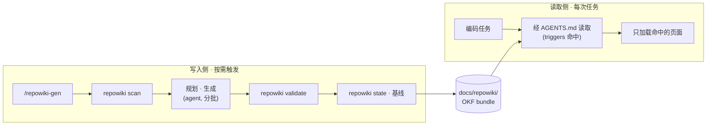

<div align="center">


# repowiki

**从代码库生成、供 Agent 阅读的项目知识库。**

[](LICENSE)
[](https://nodejs.org)
[](#)
[](https://github.com/JAYY513/repowiki/stargazers)

[English](README.md) · **简体中文**

</div>


---

## 为什么需要 repowiki？

编码 Agent 在每次会话里都要从头重新认识你的项目。哪怕回答一个简单的「X 是怎么工作的？」，它也要翻几十个文件——慢、贵、还不稳定。

**repowiki 把代码库变成一份写给 Agent 读的小型 wiki：**

- 每个页面声明 `triggers`——Agent 只加载任务需要的那几页（*route-before-body*），永远不读整个 wiki。
- git 基线记录了 wiki 描述的确切提交——`repowiki status` 能在它过期的第一时间告诉你。
- 机器负责生成，人保持掌控——手工修改过和 `protected` 的页面在重生成时原样保留。

## 特性

| 能力 | 说明 |
|---|---|
| **OKF bundle 产物** | 两族结构：`knowledge/` 模块卡（五维、`dimension` 键控）与 `content/` 文章；页面统一携带 `status` / `type` / `triggers` / `description` frontmatter |
| **零依赖 CLI** | 单个 Node.js 文件，无依赖树——只需 Node ≥ 18 |
| **新鲜度基线** | `state.json` 把 wiki 钉在某个提交上；CI 友好退出码（`0` 新鲜 · `10` 过期 · `11` 缺失） |
| **幂等接线** | `repowiki init` 向 `AGENTS.md` 注入管理块——重跑即 no-op；手写 `## repowiki` 只补缺失声明行，其余原样保留 |
| **安全扫描** | 跳过密钥文件（`.env`、key 等）、超过 1 MB 的大文件和被忽略路径；尊重 `.gitignore` 与 `.repowikiignore` |
| **人工保护** | content hash 识别手工修改；`protected: true` 永久锁定页面；中断的运行凭 `run.json` 断点续跑 |

## 工作原理



写入侧只在你主动要求时运行（`/repowiki-gen`）；读取侧在每次任务中运行：读取器拿任务意图匹配页面 `triggers`，只加载最小必要的上下文。

## 快速开始

**环境要求** —— Node.js ≥ 18、git，以及支持 `.agents` 标准的 Agent。

**1 · 安装技能**

```bash
npx skills add JAYY513/repowiki
```

<details>
<summary>手动安装（备用）</summary>

把 `skills/repowiki-gen/` 复制进你的技能目录，例如 `~/.agents/skills/` 或 `<项目>/.agents/skills/`。

</details>

**2 · 对你的 Agent 说：「生成 repowiki」**（或运行 `/repowiki-gen`）

到此为止。技能会先自动执行 `repowiki init`（幂等）完成项目接线（`AGENTS.md` 管理块 + 新鲜度基线），再扫描代码库，随后规划、写作、校验并把整套 wiki 落到 `docs/repowiki/`——全程不需要你亲自碰 CLI。

**3 · 保持新鲜**

接线会让你的 Agent 在工作中自查新鲜度——有新提交导致 wiki 过期时，它会主动提示，此时再说一次「生成 repowiki」即可。重生成是增量的：只重写受影响的页面，手工修改过和 `protected` 的页面原样保留。

## 实际效果

以下输出取自本仓库（生成于 2026-09-11，基线 `b13fdc4`）。

**`repowiki scan`** —— 遍历仓库，为每个文件建立指纹：

```
$ repowiki scan --json
{
  "stats": { "total_files": 11, "total_lines": 4103,
             "languages": { "markdown": 6, "javascript": 2, "json": 1, "other": 2 } },
  "excluded": { "files": [{ "path": "assets/logo.png", "reason": "binary" }], "size_limit": "1MB" }
}
```

**`repowiki status`** —— 新鲜度变成一个数字，为 hooks 而生：

```
$ repowiki status --json
{"status":"fresh","commit":"b13fdc4be9089225805f0dbfc28b2a49adb3a4cb"}

$ repowiki status --quiet
fresh
```

**`repowiki validate`** —— OKF bundle 校验零错误零警告：

```
$ repowiki validate --json
{ "valid": true, "errors": [], "warnings": [] }
```

**生成产物** —— 一次 `/repowiki-gen` 之后的 `docs/repowiki/`：

```
docs/repowiki/
├── index.md                 路由入口：模块清单 + 文章清单
├── knowledge/
│   ├── CLI-工具/              五维知识卡（概述 · 架构设计 · 技术栈 · 编码规范 · 特殊配置与命令）
│   └── 生成技能/              驱动流水线的技能模块
├── content/                 项目总览 · 快速开始 · 产物格式
└── log.md                   生成日志（模式、基线、覆盖率、validate 结果）
```

每个页面都带这样的 frontmatter——读取侧正是靠它做命中匹配：

```markdown
---
status: stable
type: module
dimension: overview
triggers:
  - CLI 命令
  - repowiki 怎么用
description: repowiki CLI 的定位与职责边界：init / scan / state / status / validate 五个子命令。
---
```

完整样例就在 [docs/repowiki/](docs/repowiki/index.md)——它既是本仓自己的 wiki，也是产物参考。

## `init` 往 `AGENTS.md` 写入的完整内容

一字不差列出，供先审后跑。管理块位于 HTML 注释标记之间——重跑原位更新，你的内容放在标记之外即可：

```markdown
<!-- repowiki:begin | 由 repowiki 管理：运行 `repowiki init` 原位更新本区块；手写内容请放在标记之外 -->

## repowiki

- docs/repowiki/ — 自动生成的项目知识（未人工验证）

## Wiki 纪律

- 涉及本项目代码理解、修改、排障前，先按 `repowiki` 读取相应内容（按页面 triggers 命中加载，禁止全文扫描）。
- 提交前 / 任务收尾前，运行 `repowiki status` 自查是否过期（退出码 10 = 过期 → 提示用户运行 /repowiki-gen）。
<!-- repowiki:end -->
```

若 `AGENTS.md` 中已存在手写的 `## repowiki` 分区，则**不会**注入上面的管理块——仅在该分区最后一条记录之后追加下面这一行声明，其余内容逐字保留：

```markdown
- docs/repowiki/ — 自动生成的项目知识（未人工验证）
```

## 手动调用 CLI（可选）

技能内部已经在替你调用 CLI。想自己运行时——接 CI hook、调试、离线环境：

**方式 A · 免安装、始终最新**（需要 git）：

```bash
npx github:JAYY513/repowiki status    # 或：init · scan · state · validate
```

**方式 B · 克隆一次，从克隆运行**：

```bash
git clone https://github.com/JAYY513/repowiki.git
node repowiki/bin/repowiki.mjs status
```

高频使用？`cd repowiki && npm link` 可获得全局 `repowiki` 别名。已安装技能？技能自带内置副本 `<技能目录>/repowiki-gen/scripts/repowiki.mjs`，离线可用：`node <技能目录>/repowiki-gen/scripts/repowiki.mjs status`。

退出码：`0` 新鲜 · `10` 过期 · `11` 缺失——为 hooks 与 CI 设计（`repowiki status --quiet` 只输出一个单词）。

## CLI 参考

| 命令 | 说明 |
|---|---|
| `repowiki init` | 项目接线：`state.json` 基线 + 幂等注入 `AGENTS.md` 管理块（`## repowiki` 分区 + 读取纪律） |
| `repowiki scan` | 遍历仓库（排除密钥、大文件与被忽略路径）→ `.repowiki/snapshot.json`，含路径、SHA-256、大小与语言 |
| `repowiki state` | 打印 `.repowiki/state.json`；`state --update` 在生成结束后写入基线、页面→源映射、`content_hash`、`last_run` |
| `repowiki status` | 对比 wiki 基线与 `HEAD` → `fresh` / `stale` / `missing` |
| `repowiki validate` | 校验 `docs/repowiki/` 中的 OKF bundle——frontmatter、链接、可达性、plan 一致性 |

全局参数：`--json`（机器可读输出）、`--quiet`（最小输出，供 hooks 与 CI 使用）。

## 流水线

| 步 | 阶段 | 执行者 | 产出 |
|:---:|---|---|---|
| 0 | **wire** | `repowiki init` | `AGENTS.md` 接线 + state 基线 |
| 1 | **scan** | `repowiki scan` | `.repowiki/snapshot.json` |
| 2 | **budget** | agent | 规模档位：扁平 / 模块树 / 深度限制 |
| 3 | **plan** | agent | 模块与页面规划 → `.repowiki/plan.json` |
| 4 | **generate** | agent（分批） | 知识卡 → `knowledge/` · 文章 → `content/` |
| 5 | **link** | agent | 页面间交叉链接 |
| 6 | **validate** | `repowiki validate` | OKF 校验报告 |
| 7 | **finalize** | `repowiki state --update` | `state.json`（页面映射 + 基线 + last_run）+ 完成报告 |

## 设计要点

- **Route before body** —— 每个页面声明 `triggers`；读取器按任务意图匹配，只加载命中的页面。
- **过期是算出来的，不是猜的** —— `status` 把基线提交与 `HEAD` 做 diff。
- **重生成尊重人工** —— 页面记录 `content_hash`；手工修改过的页面默认跳过，`protected: true` 永久锁定，`--force` 可覆盖。
- **崩溃可恢复** —— 分批生成向 `run.json` 写检查点；被杀掉的运行从断点继续，而不是从头重来。
- **接线天生安全** —— `AGENTS.md` 管理块位于 HTML 注释标记之间；手写的 `## repowiki` 段落逐字保留，只补充缺失的 `docs/repowiki/` 声明行。

## 仓库结构

```
bin/repowiki.mjs            CLI —— 单文件、零依赖
skills/repowiki-gen/        agent 技能
  SKILL.md                    流水线定义
  references/                 输出规格 · 阶段指引
  scripts/repowiki.mjs        内置 CLI 副本（离线兜底）
docs/repowiki/              示例 OKF bundle（产物样例）
assets/                     banner 与 logo
AGENTS.md                   接线示例（管理块）
```

## 文档

- [技能定义](skills/repowiki-gen/SKILL.md) —— 完整流水线
- [输出规格](skills/repowiki-gen/references/output-spec.md) —— 页面模板与 frontmatter
- [流水线参考](skills/repowiki-gen/references/pipeline.md) —— 逐阶段指引
- [示例 bundle](docs/repowiki/index.md) —— 生成产物长什么样

> 读取侧：任何遵循 `.agents` 标准的 Agent 都能按 `AGENTS.md` 接线按需读取 bundle——页面携带 `triggers`，加载保持精准。无需额外工具。

## 贡献

早期项目（v0.1.0）——欢迎 issue 与 PR。命令面和格式仍可能演进。

## 许可证

[MIT](LICENSE) © JAYY513
