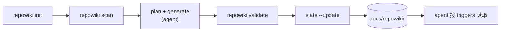

# 项目总览

<cite>
**本文引用的文件**
- [README.md](file://README.md)
- [package.json](file://package.json)
- [bin/repowiki.mjs](file://bin/repowiki.mjs)
- [skills/repowiki-gen/SKILL.md](file://skills/repowiki-gen/SKILL.md)
</cite>

## 目录

1. [引言](#引言)
2. [项目结构](#项目结构)
3. [核心组件](#核心组件)
4. [架构总览](#架构总览)
5. [快速链接](#快速链接)

## 引言

编码 Agent 每次会话都要从头重新认识项目；repowiki 把代码库变成一份写给 Agent 读的小型 wiki，用 `triggers` 让读取保持「先路由、后加载」（[README.md:22-30](file://README.md#L22-L30)）。

三个承诺：页面按需加载；git 基线让过期可计算（`repowiki status`）；机器生成、人类掌控——手改与 `protected` 页面在重生成时保留。

## 项目结构

```
bin/repowiki.mjs            CLI —— 单文件、零依赖
skills/repowiki-gen/        agent 技能（SKILL.md + references/ + scripts/）
docs/repowiki/              示例 OKF bundle（knowledge/ 卡 + content/ 文章）
assets/                     banner 与 logo
AGENTS.md                   接线示例（管理块）
```

布局同 [README.md:156-167](file://README.md#L156-L167)；运行时状态另存于 `.repowiki/`，本地保存、不入库（`.gitignore` 第 5 行）。

## 核心组件

- **CLI（`bin/repowiki.mjs`）**：`init` / `scan` / `state` / `status` / `validate` 五个子命令，单文件、零依赖，Node ≥ 18（[bin/repowiki.mjs:1366-1388](file://bin/repowiki.mjs#L1366-L1388)）。
- **生成技能（`skills/repowiki-gen/`）**：agent 的流水线指令与写作规范，产出两族页面。
- **接线（`AGENTS.md`）**：`init` 注入的管理块声明 `docs/repowiki/` 为知识源，并附读取纪律。
- **产物 bundle（`docs/repowiki/`）**：`knowledge/` 一模块一文件 + `content/` 文章，`index.md` 为唯一路由入口。

## 架构总览

写入侧按需运行（`/repowiki-gen`），读取侧每次任务生效：



图表来源
- [skills/repowiki-gen/SKILL.md:14-25](file://skills/repowiki-gen/SKILL.md#L14-L25)

## 快速链接

- 模块知识：[CLI 工具](../knowledge/CLI-工具.md)、[生成技能](../knowledge/生成技能.md)
- 上手：[快速开始](快速开始.md)
- 产物深入：[产物格式](产物格式.md)
